# CAD Inspection Tool 用户手册（简体中文）

本文档由实际运行的应用程序自动截图生成。截图保存在 `docs/screenshots/`，并作为本文档描述 UI 状态的依据。当前截图使用中文界面、`xintai.dxf`、`cadrefs_camera_capture.png` 和 `query2.txt` 生成。

## 文档索引

- [1. 主窗口](#1-主窗口)
- [2. 加载 DXF](#2-加载-dxf)
- [3. CAD 画布浏览](#3-cad-画布浏览)
- [4. 相机实时预览与参数](#4-相机实时预览与参数)
- [5. 标定窗口](#5-标定窗口)
- [6. 自动注册配置](#6-自动注册配置)
- [7. 测量查询编辑器](#7-测量查询编辑器)
- [8. 测量叠加与结果选择](#8-测量叠加与结果选择)
- [9. 生产测量日志查看器](#9-生产测量日志查看器)
- [10. 错误信息](#10-错误信息)
- [11. 故障排查示例](#11-故障排查示例)
- [截图索引](#截图索引)

## 1. 主窗口

### 用途
主窗口用于集中显示 DXF 特征树、CAD 画布、属性面板、工具栏和状态栏。它是加载图纸、查看特征、打开注册面板和测量窗口的入口。

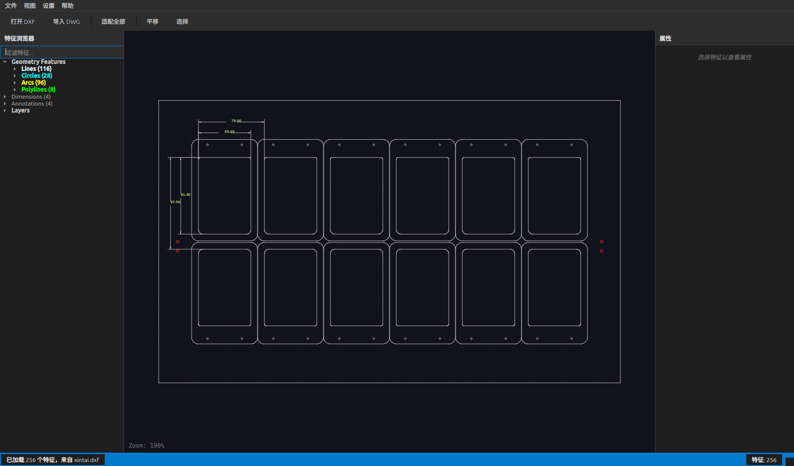

图：主窗口。

### 操作步骤
1. 启动软件后确认菜单栏、工具栏、左侧特征树、中间 CAD 画布、右侧属性区域和底部状态栏可见。
2. 使用工具栏的 `Open DXF` 打开图纸，或从菜单 `File` 中选择打开。
3. 需要测量时，打开 `View` 菜单中的 `Measurement Window`；需要注册时，打开 `Registration Panel`。

### 预期结果
主界面应完整显示，底部状态栏显示当前状态，特征计数区域显示当前加载的特征数量。

### 常见错误
- 只看见空画布：通常是尚未加载 DXF。
- 工具窗口不可见：检查 `View` 菜单中的面板开关。

### 故障排查
如果窗口内容不完整，先放大主窗口；如果仍不可见，关闭后重新启动应用。参见[第 11 节](#11-故障排查示例)。

## 2. 加载 DXF

### 用途
DXF 加载工作流将图纸解析为线、圆、圆弧等可测量 CAD 特征，并填充左侧特征树。

图：DXF 加载完成。

补充局部图：

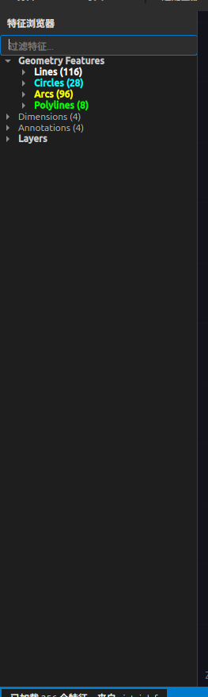

图：DXF 特征树局部。

### 操作步骤
1. 点击工具栏 `Open DXF`。
2. 选择 `xintai.dxf` 或生产对应的 DXF 文件。
3. 等待状态栏显示已加载的特征数量。
4. 在左侧特征树中展开 Lines、Circles、Arcs 等分类。

### 预期结果
状态栏显示已加载特征，特征树列出分类和条目，CAD 画布显示图形。

### 常见错误
- 文件未显示：可能选择了 DWG 或损坏 DXF。
- 特征树为空：DXF 中没有受支持实体，或导入失败。

### 故障排查
确认文件路径存在，并优先使用 DXF 格式。DWG 需要先配置转换器。

## 3. CAD 画布浏览

### 用途
CAD 画布用于查看图纸、缩放平移、选择特征，并显示图像叠加、注册结果和测量调试结果。

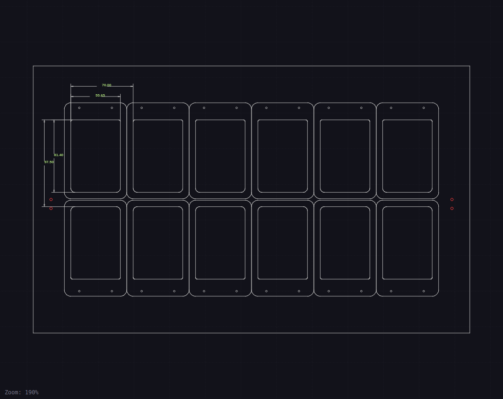

图：CAD 画布。

### 操作步骤
1. 加载 DXF 后点击 `Fit All` 适配全部图形。
2. 使用鼠标滚轮缩放，拖动画布平移。
3. 点击 CAD 特征，左侧树和右侧属性面板会同步选中。
4. 测量查询选中结果后，画布会高亮对应 CAD 和图像拟合特征。

### 预期结果
CAD 线条保持图纸颜色；拟合线、拟合圆和圆弧拟合圆以绿色显示。

### 常见错误
- 图纸看不见：先点击 `Fit All`。
- 高亮位置不对：检查自动注册参数和相机图像是否匹配。

### 故障排查
如果 CAD 与图像错位，重新执行自动注册，并检查 P1/P2 ROI 是否框住基准圆。

## 4. 相机实时预览与参数

### 用途
相机实时预览窗口用于对焦、观察采集画面，并调整曝光、Gamma、对比度、模拟增益和镜像参数。

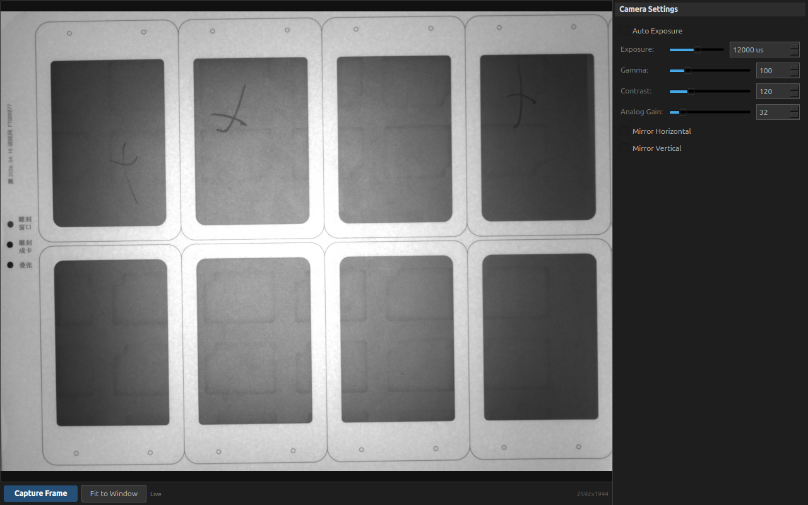

图：相机实时预览与参数。

参数局部图：

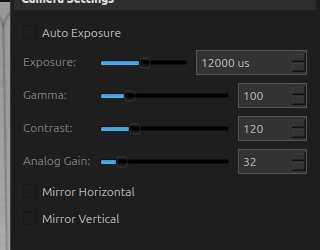

图：相机参数局部。

### 操作步骤
1. 在注册面板的相机区域选择设备并点击 `Open`。
2. 点击 `Focus Preview` 打开实时预览窗口。
3. 调整 Exposure、Gamma、Contrast、Analog Gain。
4. 对焦完成后点击 `Capture Frame` 将当前帧送入测量流程。

### 预期结果
左侧显示实时图像，右侧显示参数控件，底部显示采集按钮和分辨率。

### 常见错误
- `No camera detected`：系统未识别相机或驱动未加载。
- 图像过暗或过亮：调整曝光或启用自动曝光。

### 故障排查
先刷新设备列表，再检查相机连接、驱动和权限。无相机时可用文件图像进行注册测试。

## 5. 标定窗口

### 用途
标定窗口用于计算像素尺寸 mm/px，并执行镜头畸变标定。标定结果会影响注册和测量精度。

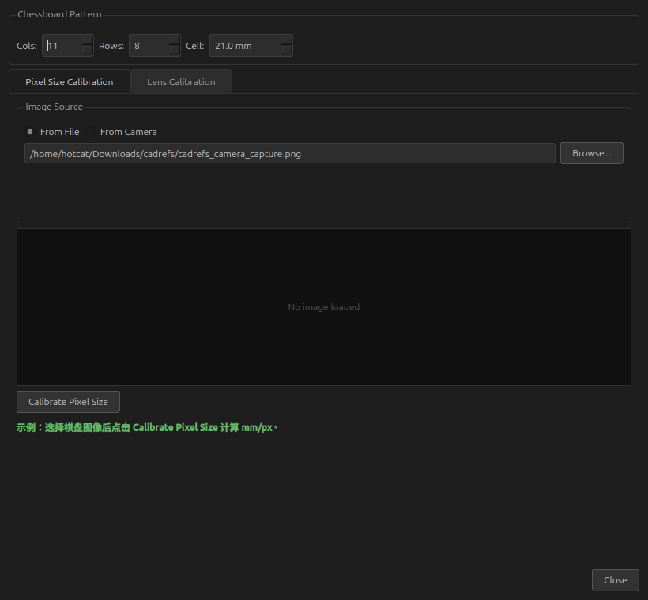

图：像素尺寸标定页。

镜头标定页：

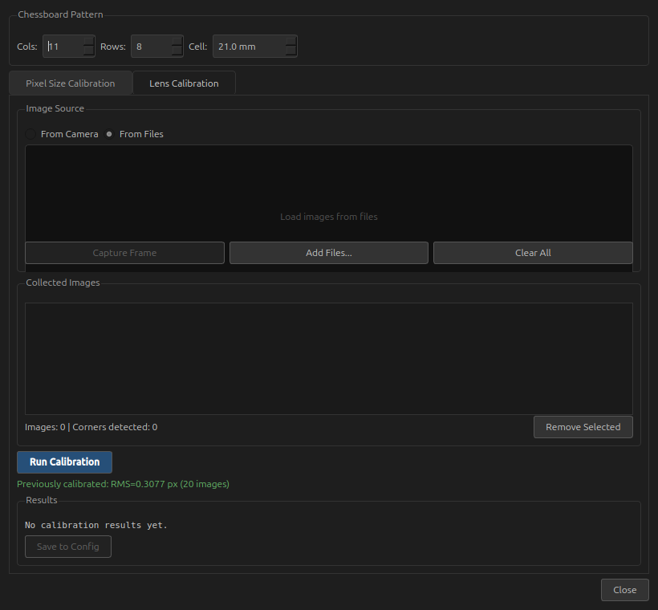

图：镜头标定页。

### 操作步骤
1. 从 `Settings` 菜单打开 `Camera Calibration...`。
2. 设置棋盘格列数、行数和单格尺寸。
3. 在 `Pixel Size Calibration` 中选择棋盘图像，点击 `Calibrate Pixel Size`。
4. 在 `Lens Calibration` 中添加多张棋盘图像，点击 `Run Calibration`。
5. 标定成功后保存到配置。

### 预期结果
像素尺寸页显示 mm/px；镜头标定页显示 RMS 误差和保存按钮。

### 常见错误
- 棋盘角点检测失败：棋盘不清晰、列/行数量设置错误或曝光不合适。
- 标定误差过大：采样姿态单一或图像数量不足。

### 故障排查
使用清晰、无遮挡、不同位置和角度的棋盘图像；确认 `Cols` 和 `Rows` 是内角点数量。

## 6. 自动注册配置

### 用途
自动注册配置通过两个 CAD 基准圆和图像 ROI 自动求解相机图像到 CAD 的变换。

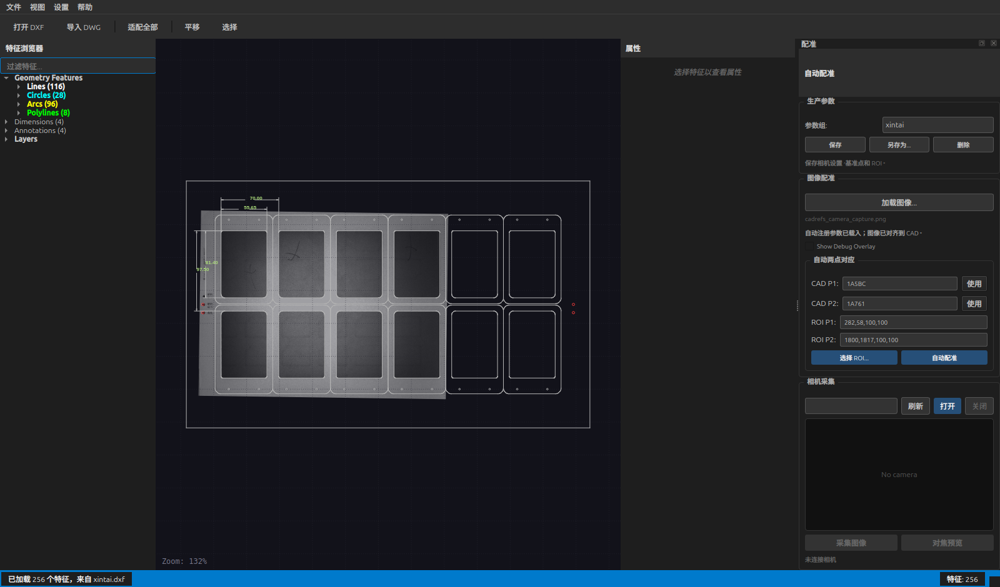

图：自动注册配置。

局部放大：

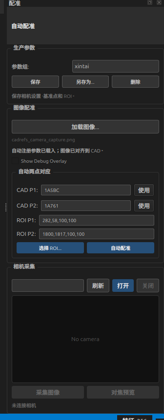

图：自动注册配置局部。

### 操作步骤
1. 加载 DXF 和相机图像。
2. 在 `Production Parameters` 中选择生产参数配置。
3. 设置 CAD P1、CAD P2，可以使用 DXF handle 或已选特征。
4. 设置 ROI P1、ROI P2，格式为 `x,y,w,h`。
5. 点击 `Auto Register`。
6. 注册成功后再运行测量查询。

### 预期结果
状态区显示自动注册成功，图像与 CAD 对齐，画布中基准圆位置一致。

### 常见错误
- ROI 格式错误：必须是四个整数。
- ROI 未框住基准圆：自动检测会失败或注册偏移。
- P1/P2 顺序反了：图像会旋转或平移错误。

### 故障排查
使用 `Pick ROIs...` 重新框选，确认 CAD P1/P2 与图像 P1/P2 一一对应。

## 7. 测量查询编辑器

### 用途
测量查询编辑器用于编写测量指令、运行评价、查看 Value/Nominal/Deviation/Threshold/Status 表格，并进入生产日志查看器。

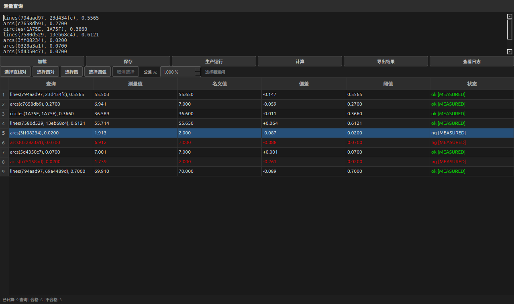

图：测量查询编辑器。

结果表局部图：

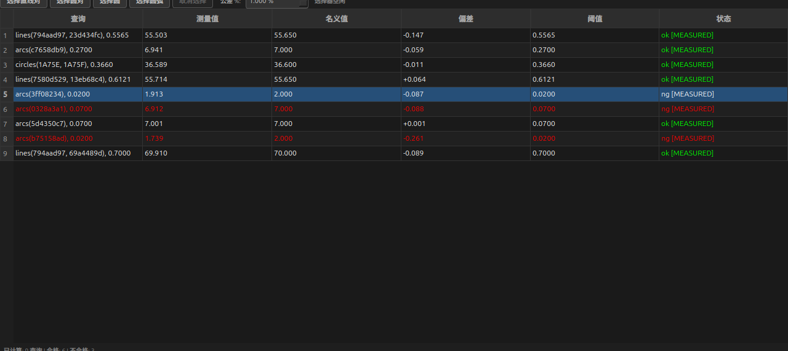

图：测量结果表局部。

### 操作步骤
1. 打开 `Measurement Window`。
2. 点击 `Load` 载入查询文件，或直接输入查询。
3. 支持 `lines(ID1, ID2)`、`circles(ID1, ID2)`、`circle(ID)`、`arcs(ID)`。
4. 点击 `Evaluate`。
5. 点击结果表中的任一行查看对应 CAD 和图像拟合特征。
6. 点击 `Run Production` 可按生产流程采集、注册、评价并保存日志。

### 预期结果
表格显示 Query、Value、Nominal、Deviation、Threshold、Status。OK/NG 状态用于快速判断是否超差。

### 常见错误
- ID 无法解析：查询中的 ID、handle 或前缀写错。
- `No Measurement`：图像未加载、未注册或边缘拟合失败。

### 故障排查
优先检查 DXF 是否正确加载；然后检查图像、自动注册和 ROI；最后检查查询语法。

## 8. 测量叠加与结果选择

### 用途
选择测量结果后，画布会显示对应测量调试叠加。拟合线和拟合圆为绿色，CAD 线条保持原颜色。圆弧查询会显示绿色拟合整圆，便于判断拟合质量。

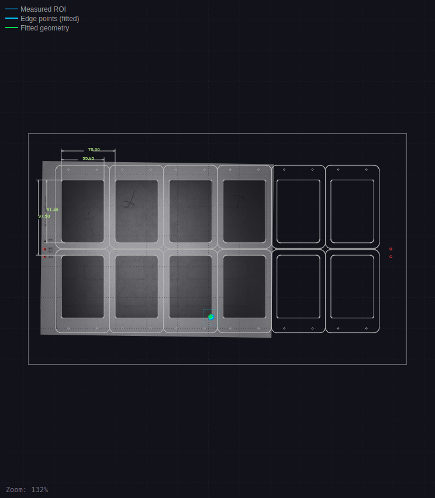

图：测量叠加显示。

### 操作步骤
1. 在测量结果表中单击一行。
2. 观察 CAD 画布中高亮的 CAD 特征和图像边缘点。
3. 对圆弧查询，重点查看绿色拟合圆是否落在目标内弧或外弧上。
4. 若拟合不正确，回到自动注册和 ROI 设置检查图像对齐。

### 预期结果
被选查询的特征被高亮，绿色拟合几何与图像实际边缘重合。

### 常见错误
- 拟合到外弧：图像边缘对比度或 ROI 限制不足。
- 绿色拟合圆偏离 CAD：注册参数或像素尺寸可能错误。

### 故障排查
重新执行自动注册；必要时调整相机曝光，确保目标边缘清晰。

## 9. 生产测量日志查看器

### 用途
生产日志查看器按日历组织生产测量记录，按 OK/NG 分类，并显示每条记录的查询结果表。日志可用于复查 CAD、相机图像、注册参数和测量结果。

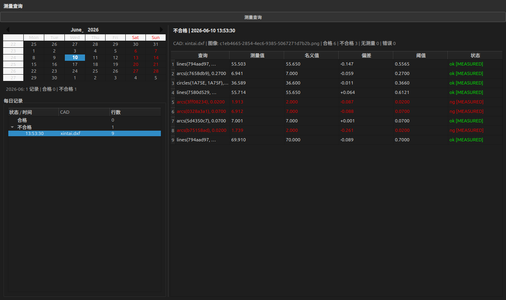

图：生产测量日志查看器。

结果表局部图：

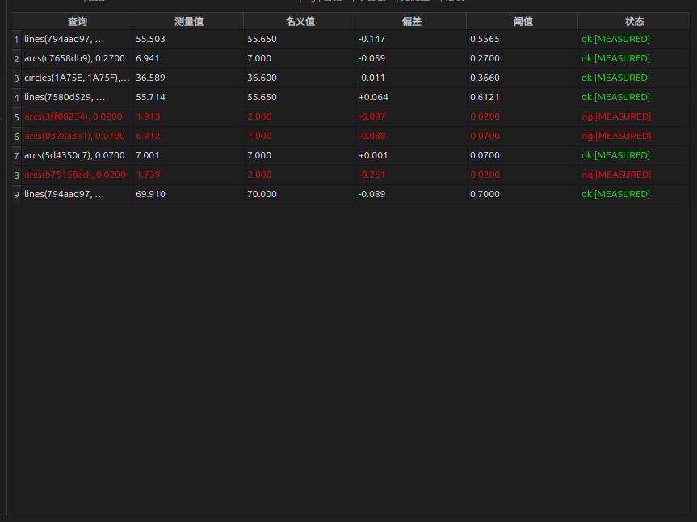

图：日志结果表局部。

### 操作步骤
1. 在测量窗口点击 `View Logs`。
2. 在日历中选择月份和日期。
3. 在 Daily Records 中展开 OK 或 NG。
4. 点击具体记录，右侧表格显示该记录的测量结果。
5. 点击结果行，主画布会加载对应 CAD/图像上下文并高亮相关特征。
6. 点击 `Measurement Queries` 返回实时查询编辑器。

### 预期结果
日历显示记录分布，左侧按 OK/NG 分类，右侧显示与查询编辑器一致的结果表头。

### 常见错误
- 某天没有记录：未执行生产流程或日志数据库路径不同。
- 记录无法复现：原 CAD 或图像文件被移动。

### 故障排查
保留生产图像和 CAD 文件；日志记录中包含文件名、仿射矩阵、注册参数和标定参数。

## 10. 错误信息

### 用途
错误信息用于指出查询语法、ID 解析、图像测量或生产流程中的失败原因。

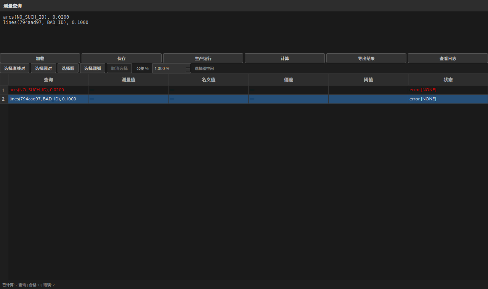

图：查询错误信息。

错误表局部图：

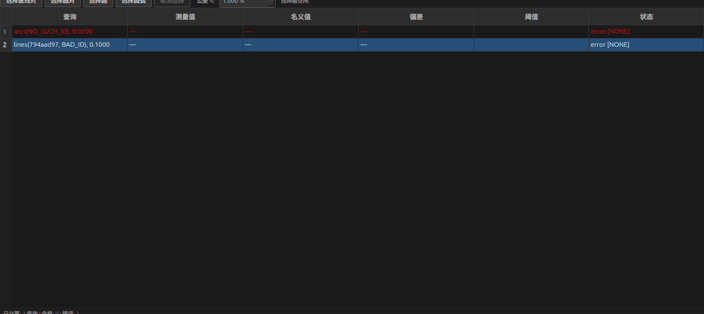

图：错误结果表局部。

警告对话框示例：

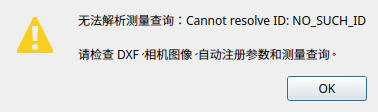

图：警告对话框。

### 操作步骤
1. 查看结果表中的 Status 和错误说明。
2. 若提示 `Cannot resolve ID`，检查查询 ID 是否存在于特征树。
3. 若提示无测量结果，检查图像和注册状态。
4. 修改查询后重新点击 `Evaluate`。

### 预期结果
错误行不会被误判为 OK；用户可以根据错误文本定位问题。

### 常见错误
- 复制了错误的短 ID。
- 使用了圆查询函数测量圆弧，或使用了线查询函数测量圆。

### 故障排查
使用 `Pick Lines Pair`、`Pick Circle`、`Pick Arc` 生成查询，可减少手写 ID 错误。

## 11. 故障排查示例

### 用途
本节展示常见生产问题的界面状态，帮助操作员快速定位问题。

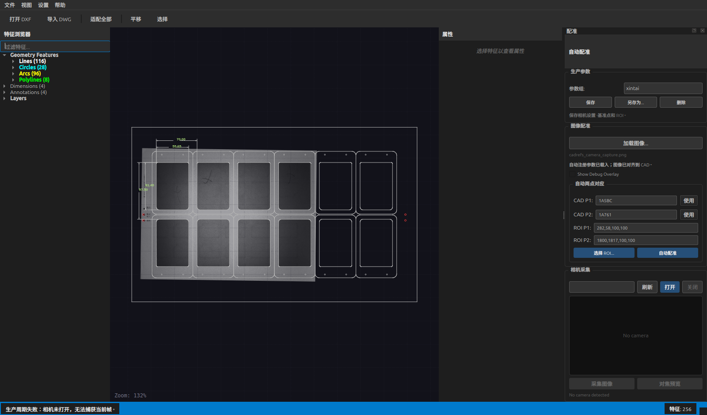

图：无相机故障排查示例。

### 操作步骤
1. 如果 `Run Production` 失败，先查看底部状态栏。
2. 如果提示相机未打开，进入注册面板确认 Camera Capture 区域。
3. 如果没有设备，点击 `Refresh` 并检查硬件连接。
4. 如果只是做离线验证，可使用 `Load Image...` 载入图像文件。
5. 图像加载后重新执行自动注册，再运行测量。

### 预期结果
问题原因应能从状态栏、相机状态或测量结果表中定位。

### 常见错误
- 未打开相机直接运行生产。
- 加载了图像但未执行自动注册。
- 使用了不匹配当前产品的生产参数配置。

### 故障排查
按顺序检查：相机连接 → 图像是否加载 → 自动注册 P1/P2 → 查询语法 → 测量结果表。

## 截图索引

| 文件 | 说明 |
|---|---|
| [01_main_window.png](screenshots/01_main_window.png) | 主窗口 |
| [02_dxf_loading.png](screenshots/02_dxf_loading.png) | DXF 加载完成 |
| [02a_feature_tree_crop.png](screenshots/02a_feature_tree_crop.png) | DXF 特征树局部 |
| [03_cad_canvas.png](screenshots/03_cad_canvas.png) | CAD 画布 |
| [04_auto_registration_configuration.png](screenshots/04_auto_registration_configuration.png) | 自动注册配置 |
| [04a_auto_registration_crop.png](screenshots/04a_auto_registration_crop.png) | 自动注册配置局部 |
| [05_camera_live_preview_parameters.png](screenshots/05_camera_live_preview_parameters.png) | 相机实时预览与参数 |
| [05a_camera_parameters_crop.png](screenshots/05a_camera_parameters_crop.png) | 相机参数局部 |
| [06_calibration_dialog.png](screenshots/06_calibration_dialog.png) | 标定窗口 |
| [06a_lens_calibration_tab.png](screenshots/06a_lens_calibration_tab.png) | 镜头标定页 |
| [07_query_measurement_editor.png](screenshots/07_query_measurement_editor.png) | 测量查询编辑器 |
| [07a_query_results_table_crop.png](screenshots/07a_query_results_table_crop.png) | 测量结果表局部 |
| [08_measurement_overlay_canvas.png](screenshots/08_measurement_overlay_canvas.png) | 测量叠加显示 |
| [09_measurement_log_viewer.png](screenshots/09_measurement_log_viewer.png) | 生产测量日志查看器 |
| [09a_log_results_table_crop.png](screenshots/09a_log_results_table_crop.png) | 日志结果表局部 |
| [10_error_messages_query.png](screenshots/10_error_messages_query.png) | 查询错误信息 |
| [10a_error_table_crop.png](screenshots/10a_error_table_crop.png) | 错误结果表局部 |
| [11_troubleshooting_no_camera.png](screenshots/11_troubleshooting_no_camera.png) | 无相机故障排查示例 |
| [10b_warning_dialog.png](screenshots/10b_warning_dialog.png) | 警告对话框 |
