# AutoMetrology 用户手册（简体中文）

本文档基于 2026-07-08 实际运行的软件界面更新。截图保存在 `docs/screenshots/`。本次更新使用真实 Hikvision 相机实时采集图像、当前配置文件、以及 CAD 文件：

`/home/hotcat/Downloads/cadrefs/cads/弘毅云佳-工位牌-（大号）无挂绳孔V1.1_窗口雕刻测量22222.dxf`

本次实测流程：打开相机 → 采集当前帧 → 暗窗口 Window Register → 运行 Measurement Queries → 保存生产日志。实测像素尺寸为 `0.027696345 mm/px`，镜头校正已应用，Correction Map 开关为关闭状态，窗口注册使用 `AB8E:7 / AB8E:1 / AB8E:3 / AB8E:5` 四条窗口边。

## 文档索引

1. [主窗口与 DXF 加载](#1-dxf)
2. [相机采集与实时预览](#2)
3. [窗口注册](#3)
4. [测量查询](#4)
5. [测量叠加与结果复查](#5)
6. [生产日志](#6)
7. [标定与校正选项](#7)
8. [常见问题](#8)
9. [截图索引](#9)

## 1. 主窗口与 DXF 加载

主窗口包含菜单栏、工具栏、特征浏览器、CAD 画布、属性面板和状态栏。加载 DXF 后，左侧特征树显示 Lines、Circles、Text 等几何实体，CAD 画布显示图纸。

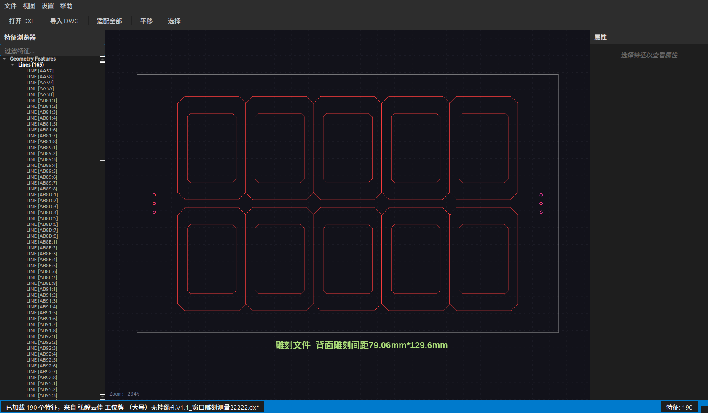

操作步骤：

1. 点击 `打开 DXF`。
2. 选择当前产品 CAD 文件。
3. 点击 `适配全部`，让 CAD 图形完整进入视野。
4. 在左侧特征浏览器中展开 Lines，确认窗口边、印刷线、外轮廓线等实体可见。

本次示例加载结果为 190 个特征：165 条线、24 个圆、1 个文字对象。

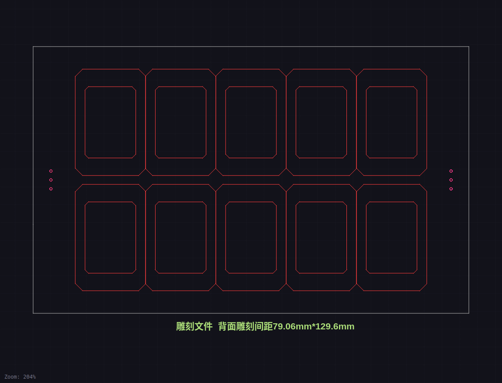

注意事项：

- 查询和注册使用的是 CAD 特征 ID、DXF handle 或唯一前缀。对于由 polyline 打散得到的线，常见 ID 形式为 `AB8E:3`。
- 如果画布为空，先确认 DXF 路径正确，再点击 `适配全部`。
- 如果特征树没有叶节点，通常是 DXF 导入失败或筛选框过滤了特征。

## 2. 相机采集与实时预览

相机区域位于右侧 Registration 面板中的 `Camera Capture`。本次实测相机为 `Hikvision MV-CS200-10UM`。

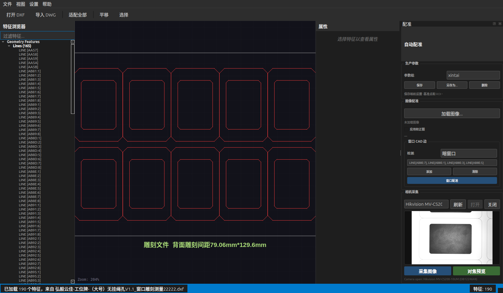

操作步骤：

1. 打开 `视图` → `Registration Panel`。
2. 在 `Camera Capture` 中选择相机。
3. 点击 `打开`，确认预览区域出现实时图像。
4. 需要对焦时点击 `对焦预览`。
5. 点击 `采集图像`，当前帧会被送入 CAD 画布作为图像层。

本次采集到的当前帧如下：

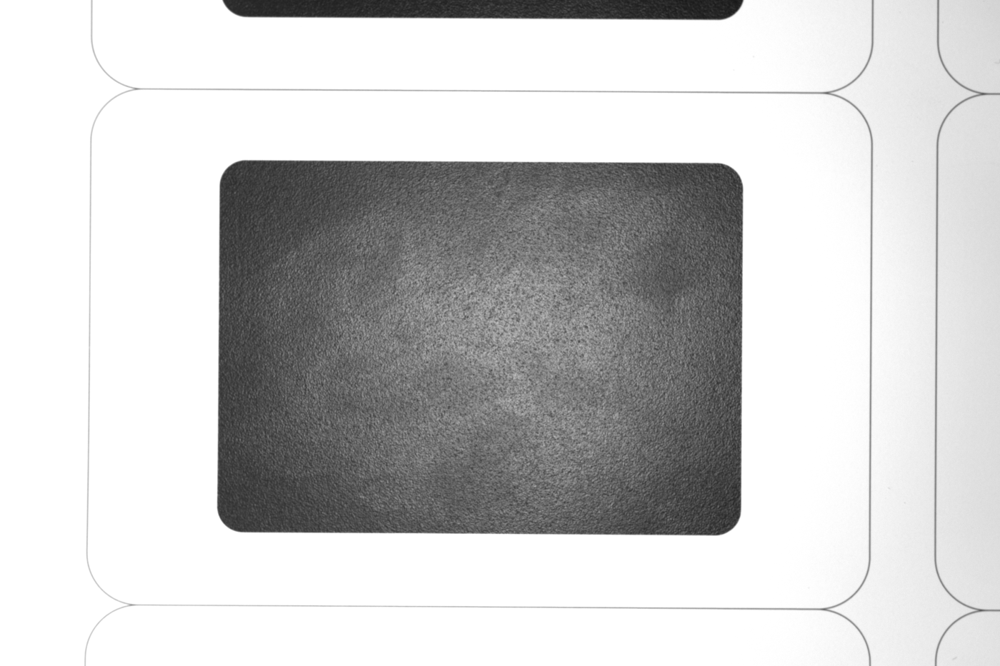

采集成功后，状态栏会显示图像已加载，Registration 面板中图像路径显示为相机采集。若已保存镜头标定，采集时会先执行 OpenCV 镜头去畸变，再进入注册和测量。

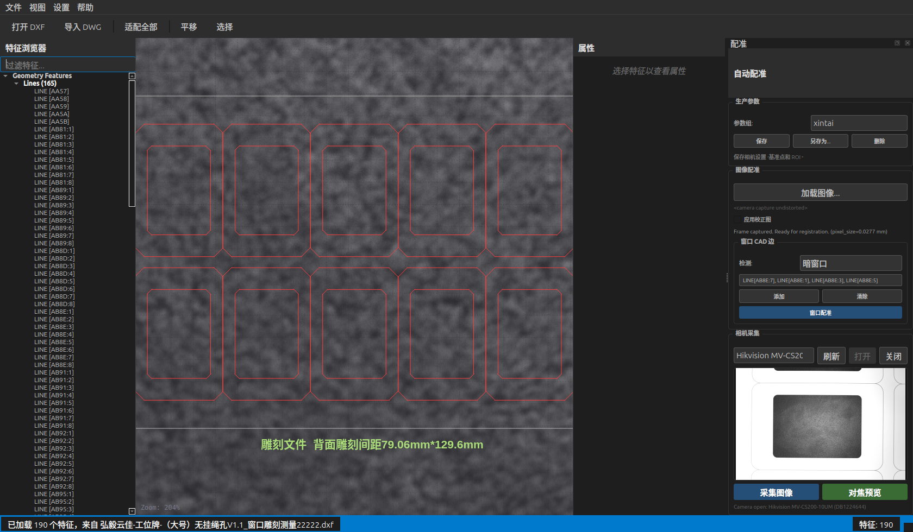

注意事项：

- 如果 `采集图像` 按钮不可用，先确认相机已经打开。
- 如果画面过曝或过暗，调整曝光、增益、Gamma 或背光。
- 生产测量建议使用稳定背光，避免薄膜反光造成边缘灰度带漂移。

## 3. 窗口注册

当前生产流程使用 Window Register。软件根据指定 CAD 窗口边在相机图像中寻找窗口边缘，计算图像到 CAD 的变换。显示可使用 homography 贴合窗口，测量使用 edge affine，避免投影变换影响尺寸测量。

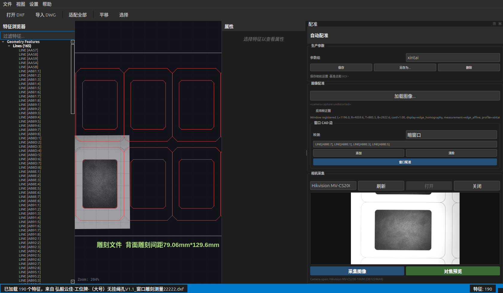

本次注册配置：

| 项目 | 值 |
|---|---|
| 检测模式 | 暗窗口 |
| CAD 窗口边 | `LINE[AB8E:7]`, `LINE[AB8E:1]`, `LINE[AB8E:3]`, `LINE[AB8E:5]` |
| 注册置信度 | `0.9963` |
| 显示模型 | `edge_homography` |
| 测量模型 | `edge_affine` |
| Correction Map | 关闭 |

操作步骤：

1. 在 `窗口 CAD 边` 区域选择检测模式：暗窗口、亮窗口或自动。
2. 输入或选择 4 条窗口 CAD 边。
3. 点击 `窗口配准`。
4. 观察 CAD 红线是否与相机图像窗口边重合。
5. 如果位置正确，再进入 Measurement Queries 点击 `计算` 或 `生产运行`。

注意事项：

- 对窗口类产品，窗口边通常由 CNC 或雕刻加工，几何稳定性高，适合作为注册基准。
- 对网格排列产品，只需要选择当前被相机看到的单个产品窗口边，不需要让程序猜整个阵列。
- 如果 CAD 与图像出现 180 度翻转，检查四条窗口边是否属于同一个产品窗口，且没有混入相邻产品边。
- Correction Map 开关只用于比较残差/坐标校正影响。当前实测中关闭该开关后，窗口注册和测量仍正常。

## 4. 测量查询

Measurement Queries 用于编辑测量表达式、运行测量、查看结果。查询文本现在保存在主配置文件中，会自动保存；界面中不再使用单独的查询文件 Load/Save。

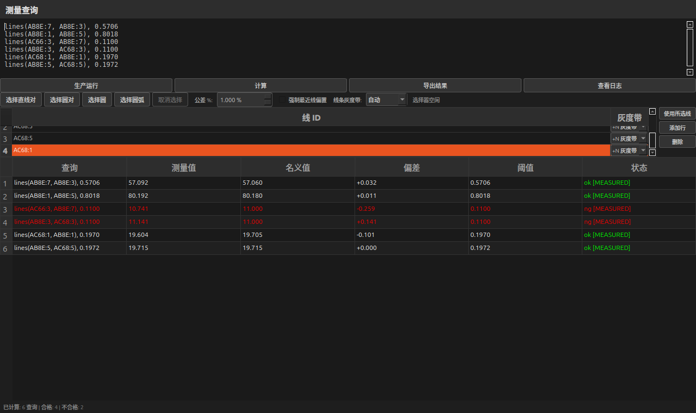

当前配置中的查询为：

```text
lines(AB8E:7, AB8E:3), 0.5706
lines(AB8E:1, AB8E:5), 0.8018
lines(AC66:3, AB8E:7), 0.1100
lines(AB8E:3, AC68:3), 0.1100
lines(AC68:1, AB8E:1), 0.1970
lines(AB8E:5, AC68:5), 0.1972
```

支持的表达式：

| 表达式 | 用途 |
|---|---|
| `lines(ID1, ID2), threshold` | 两条线之间的距离 |
| `circles(ID1, ID2), threshold` | 两个圆心之间的距离 |
| `circle(ID), threshold` | 圆半径 |
| `arcs(ID), threshold` | 圆弧半径 |

本次当前帧实测结果：

| 查询 | 测量值 | 名义值 | 偏差 | 阈值 | 状态 |
|---|---:|---:|---:|---:|---|
| `lines(AB8E:7, AB8E:3)` | 57.0922 | 57.0600 | +0.0322 | 0.5706 | OK |
| `lines(AB8E:1, AB8E:5)` | 80.1915 | 80.1800 | +0.0115 | 0.8018 | OK |
| `lines(AC66:3, AB8E:7)` | 10.7413 | 11.0000 | -0.2587 | 0.1100 | NG |
| `lines(AB8E:3, AC68:3)` | 11.1410 | 11.0000 | +0.1410 | 0.1100 | NG |
| `lines(AC68:1, AB8E:1)` | 19.6038 | 19.7048 | -0.1010 | 0.1970 | OK |
| `lines(AB8E:5, AC68:5)` | 19.7155 | 19.7152 | +0.0003 | 0.1972 | OK |

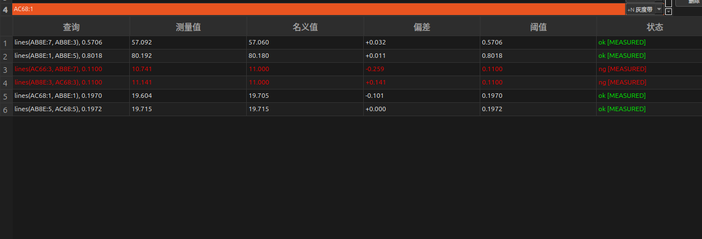

查询区常用控件：

- `生产运行`：采集相机图像、执行窗口注册、计算查询并保存生产日志。
- `计算`：使用当前已加载图像和当前注册结果重新计算查询。
- `导出结果`：将当前结果导出为文本或 CSV。
- `查看日志`：进入生产日志查看器。
- `选择直线对`、`选择圆对`、`选择圆`、`选择圆弧`：通过点击 CAD 特征自动生成查询。
- `强制最近线偏置`：对印刷线/窗口线组合，优先使用靠近窗口边的那一侧印刷灰度带。
- `线条灰度带`：全局选择 Auto、+N band、-N band。
- Line ID 表：按单条线覆盖灰度带选择。本次配置中 `AC66:3` 使用 `-N`，`AC68:3 / AC68:5 / AC68:1` 使用 `+N`。

注意事项：

- 查询 ID 可以是完整 feature id、DXF handle、或唯一短前缀。
- 若结果为 `no_measurement[NONE]`，表示图像测量失败，不会回退到 CAD 名义值。
- 表格中的 `[MEASURED]` 表示结果来自图像拟合，而不是直接使用 CAD。

## 5. 测量叠加与结果复查

点击结果表中的任一行，主画布会高亮对应 CAD 特征，并显示图像拟合得到的测量几何。绿色拟合线/圆应贴合真实图像边缘。

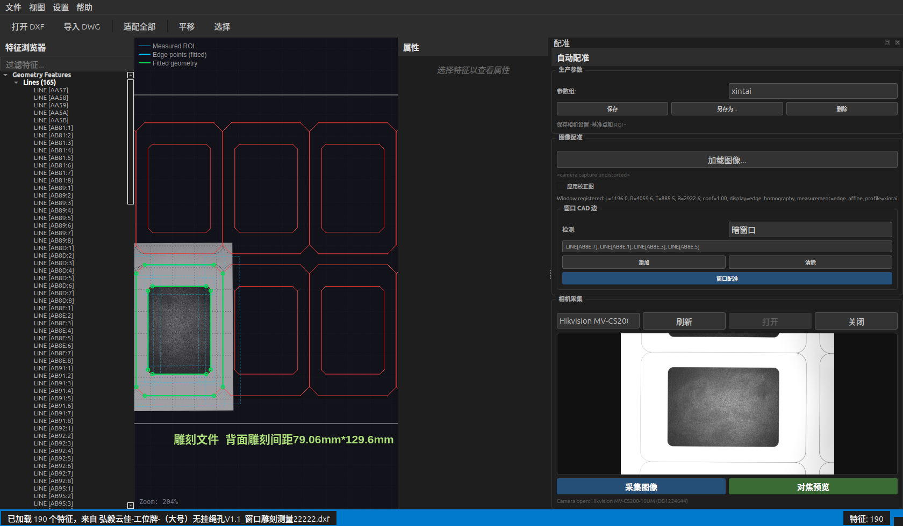

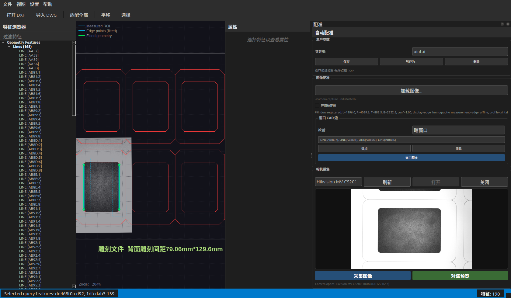

复查方法：

1. 在结果表中点击偏差较大的行。
2. 观察绿色拟合线是否落在预期灰度带上。
3. 如果拟合到另一侧印刷带，在 Line ID 表中切换该线的 `+N/-N`。
4. 如果边缘模糊，优先检查背光、薄膜反光、曝光和焦点。
5. 如果所有结果整体偏移，优先重新执行窗口注册。

## 6. 生产日志

`生产运行` 会将当前 CAD、采集图像、注册参数、标定信息、测量查询和结果写入生产日志。日志按日期组织，并按合格/不合格分类。

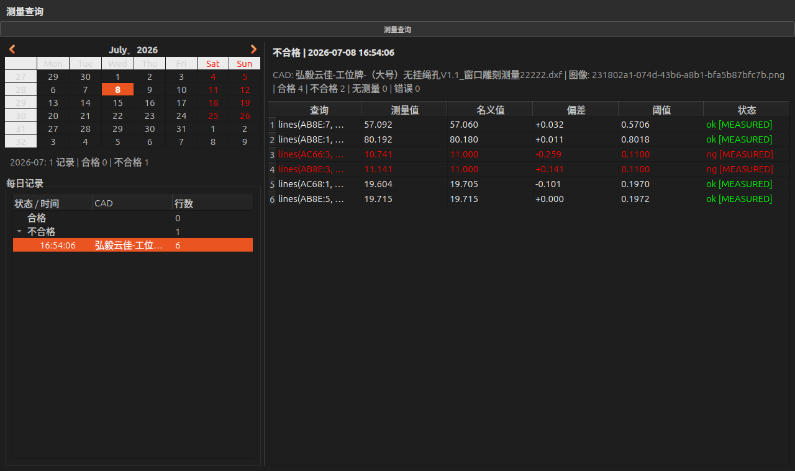

本次日志记录：

- 时间：2026-07-08 16:54:06
- 结果：合格 4，不合格 2，无测量 0，错误 0
- 图像：由当前相机帧保存到日志目录
- 注册：window_line_registration_dark

操作步骤：

1. 在 Measurement Queries 中点击 `查看日志`。
2. 在日历中选择日期。
3. 展开合格或不合格分类。
4. 点击记录，右侧显示该次生产测量的完整结果。
5. 点击结果行可回放该次记录的图像和测量叠加。

## 7. 标定与校正选项

相机标定位于 `设置` → `Camera Calibration...`。当前系统通常需要：

- Pixel Size Calibration：确定 mm/px。
- Lens Calibration：保存 OpenCV 镜头畸变参数。
- Correction Map：可选残差/坐标校正，用于诊断或特殊场景。

当前经验结论：

- 大覆盖率、高质量棋盘图像对 CAD 线与印刷线平行性贡献最大。
- 对当前镜头，标准 OpenCV 标定模型已经足够，不必默认启用 rational/thin-prism/tilted 模型。
- Correction Map 开关用于比较残差校正影响；本次实测关闭后视觉对齐仍正常。
- Window Register 的测量变换使用 affine，可以避免显示 homography 对尺寸测量产生不必要影响。

使用建议：

1. 使用覆盖 90% 左右视野的棋盘采集多张图像。
2. 保留不同位置、不同角度、清晰无拖影的图片。
3. 删除角点检测错误或 reprojection outlier 明显的图片。
4. 标定后用实际产品线条检查是否仍存在局部弯曲或方向性误差。
5. 只有在标准模型无法解释残差时，再逐步测试更复杂模型。

## 8. 常见问题

### 8.1 相机打不开

处理顺序：

1. 确认 Hikvision MVS 能枚举相机。
2. 在 Registration Panel 点击 `刷新`。
3. 确认没有其他程序独占相机。
4. 重新点击 `打开`。

### 8.2 `生产运行` 失败在窗口注册阶段

常见原因：

- 未采集图像。
- 当前 DXF 与窗口边配置不匹配。
- 窗口边 ID 不属于同一个产品。
- 检测模式选择错误，例如亮窗口图像却使用暗窗口模式。

处理方法：

1. 先手动点击 `采集图像`。
2. 再点击 `窗口配准`。
3. 确认 CAD 红线与相机窗口边重合。
4. 最后再运行 Measurement Queries。

### 8.3 印刷线测量偏差大

印刷线不是高精度加工基准，可能有收缩、扩张、油墨厚度和灰度带双边问题。处理顺序：

1. 确认窗口注册准确。
2. 检查 Line ID 表中该线的灰度带选择。
3. 尝试 `强制最近线偏置`。
4. 使用背光提高边缘稳定性。
5. 记录多次重复性，区分系统偏差和随机噪声。

### 8.4 查询不自动保存

Measurement Queries 的文本保存在主配置文件中。正常情况下编辑后会自动保存，关闭程序时也会再次写入。界面不再提供单独的查询文件 Load/Save。

### 8.5 结果显示 `no_measurement[NONE]`

这表示图像中没有可靠拟合到对应特征。软件不会用 CAD 名义值冒充测量值。需要检查图像、注册、查询 ID、灰度带选择和边缘质量。

## 9. 截图索引

| 文件 | 说明 |
|---|---|
| [01_main_window.png](screenshots/01_main_window.png) | 主窗口和 Hongyi DXF |
| [03_cad_canvas.png](screenshots/03_cad_canvas.png) | CAD 画布 |
| [04_registration_camera_open.png](screenshots/04_registration_camera_open.png) | 相机打开后的注册面板 |
| [05_live_capture_frame.png](screenshots/05_live_capture_frame.png) | 当前实时采集帧 |
| [06_frame_captured.png](screenshots/06_frame_captured.png) | 图像采集后 |
| [07_window_registered.png](screenshots/07_window_registered.png) | Window Register 完成 |
| [08_measurement_queries.png](screenshots/08_measurement_queries.png) | Measurement Queries 当前结果 |
| [08a_measurement_results_crop.png](screenshots/08a_measurement_results_crop.png) | 测量结果局部 |
| [09_measurement_overlay_canvas.png](screenshots/09_measurement_overlay_canvas.png) | 测量叠加 |
| [10_selected_measurement_overlay.png](screenshots/10_selected_measurement_overlay.png) | 选中测量行后的叠加 |
| [11_production_log_viewer.png](screenshots/11_production_log_viewer.png) | 生产日志查看器 |
